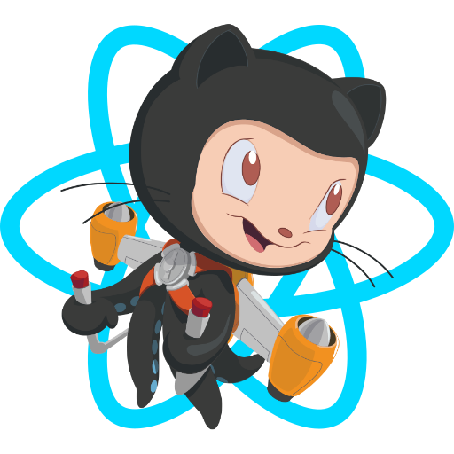

# Sokoban Action

<table>
    <tr>
        <td>
            
        </td>
        <td>
            
        </td>
        <td>
            
        </td>
        <td>
            
        </td>
        <td>
            
        </td>
        <td>
            
        </td>
    </tr>
    <tr>
        <td>
            
        </td>
        <td>
            
        </td>
        <td>
            
        </td>
        <td>
            
        </td>
        <td>
            
        </td>
        <td>
            
        </td>
    </tr>
    <tr>
        <td>
            
        </td>
        <td>
            
        </td>
        <td>
            
        </td>
        <td>
            
        </td>
        <td>
            
        </td>
        <td>
            
        </td>
    </tr>
    <tr>
        <td>
            
        </td>
        <td>
            
        </td>
        <td>
            
        </td>
        <td>
            
        </td>
        <td>
            
        </td>
        <td>
            
        </td>
    </tr>
</table>

<h1>
  <a href="https://github.com/RaisinTen/sokoban-action/issues/new?title=$U&body=Just+push+%27Submit+new+issue%27.+You+don%27t+need+to+do+anything+else.">:arrow_up:</a>
  <a href="https://github.com/RaisinTen/sokoban-action/issues/new?title=$D&body=Just+push+%27Submit+new+issue%27.+You+don%27t+need+to+do+anything+else.">:arrow_down:</a>
  <a href="https://github.com/RaisinTen/sokoban-action/issues/new?title=$R&body=Just+push+%27Submit+new+issue%27.+You+don%27t+need+to+do+anything+else.">:arrow_right:</a>
  <a href="https://github.com/RaisinTen/sokoban-action/issues/new?title=$L&body=Just+push+%27Submit+new+issue%27.+You+don%27t+need+to+do+anything+else.">:arrow_left:</a>
  <a href="https://github.com/RaisinTen/sokoban-action/issues/new?title=$B&body=Just+push+%27Submit+new+issue%27.+You+don%27t+need+to+do+anything+else.">:leftwards_arrow_with_hook:</a>
</h1>