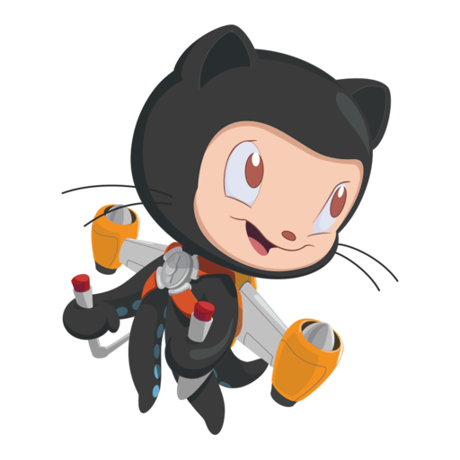

# Sokoban Action

<table>
    <tr>
        <td>
            
        </td>
        <td>
            
        </td>
        <td>
            
        </td>
        <td>
            
        </td>
        <td>
            
        </td>
        <td>
            
        </td>
        <td>
            
        </td>
        <td>
            
        </td>
    </tr>
    <tr>
        <td>
            
        </td>
        <td>
            
        </td>
        <td>
            
        </td>
        <td>
            
        </td>
        <td>
            
        </td>
        <td>
            
        </td>
        <td>
            
        </td>
        <td>
            
        </td>
    </tr>
    <tr>
        <td>
            
        </td>
        <td>
            
        </td>
        <td>
            
        </td>
        <td>
            
        </td>
        <td>
            
        </td>
        <td>
            
        </td>
        <td>
            
        </td>
        <td>
            
        </td>
    </tr>
    <tr>
        <td>
            
        </td>
        <td>
            
        </td>
        <td>
            
        </td>
        <td>
            
        </td>
        <td>
            
        </td>
        <td>
            
        </td>
        <td>
            
        </td>
        <td>
            
        </td>
    </tr>
    <tr>
        <td>
            
        </td>
        <td>
            
        </td>
        <td>
            
        </td>
        <td>
            
        </td>
        <td>
            
        </td>
        <td>
            
        </td>
        <td>
            
        </td>
        <td>
            
        </td>
    </tr>
    <tr>
        <td>
            
        </td>
        <td>
            
        </td>
        <td>
            
        </td>
        <td>
            
        </td>
        <td>
            
        </td>
        <td>
            
        </td>
        <td>
            
        </td>
        <td>
            
        </td>
    </tr>
</table>

<h1>
  <a href="https://github.com/RaisinTen/sokoban-action/issues/new?title=$U&body=Just+push+%27Submit+new+issue%27.+You+don%27t+need+to+do+anything+else.">:arrow_up:</a>
  <a href="https://github.com/RaisinTen/sokoban-action/issues/new?title=$D&body=Just+push+%27Submit+new+issue%27.+You+don%27t+need+to+do+anything+else.">:arrow_down:</a>
  <a href="https://github.com/RaisinTen/sokoban-action/issues/new?title=$R&body=Just+push+%27Submit+new+issue%27.+You+don%27t+need+to+do+anything+else.">:arrow_right:</a>
  <a href="https://github.com/RaisinTen/sokoban-action/issues/new?title=$L&body=Just+push+%27Submit+new+issue%27.+You+don%27t+need+to+do+anything+else.">:arrow_left:</a>
  <a href="https://github.com/RaisinTen/sokoban-action/issues/new?title=$B&body=Just+push+%27Submit+new+issue%27.+You+don%27t+need+to+do+anything+else.">:leftwards_arrow_with_hook:</a>
</h1>

## Instructions

[Sokoban](https://en.wikipedia.org/wiki/Sokoban) is a game where you are supposed to push each box to a goal.

### Items

| Name        | Item                                             | Description                                                                                                                                                            |
| :---:       | :---:                                            | :---:                                                                                                                                                                  |
| **Octocat** |  | You can move me in all 4 directions with :arrow_up:, :arrow_down:, :arrow_right:, :arrow_left: and go back a move with :leftwards_arrow_with_hook: when you are stuck. |
| **Box**     |      | I get pushed in the direction Octocat moves. When I am pushed into a goal, I turn blue!                                                                                |
| **Goal**    |       | When a box is pushed into me, it turns blue!                                                                                                                           |
| **Wall**    |       | You can't push me.                                                                                                                                                     |

### Working

#### GitHub Actions

This game is made using GitHub Actions! When you click on the controls, it opens a new issue with a text to trigger the workflow. After you submit the issue, the action starts running and updates the [board](README.md) and replies to your issue.

To know more about this, check out <a href="https://dev.to/raisinten/sokoban-action-ji9">the blog on </a>!

Now push! :smiley:

## Code of Conduct

Please refer to the [code of conduct](CODE_OF_CONDUCT.md) for the rules for interacting with this project.

## License

This project is licensed under the [MIT License](LICENSE).